# AUPP LMS DevOps CI/CD Pipeline (Jenkins + SonarQube + Trivy + Docker + Terraform + Prometheus + Grafana)

## Project Overview

This project implements a complete **CI/CD pipeline** for AUPP's internal Learning Management System (LMS) platform (similar to Canvas LMS).

### Goals

- Fast feature delivery
- Secure deployments
- Automated infrastructure provisioning
- Real-time monitoring

### Core Stack

The CI/CD pipeline is implemented using **Jenkins**, with integrations including:

- SonarQube (Code Quality)
- Trivy (Security Scanning)
- Docker (Containerization)
- Terraform (Infrastructure as Code)
- AWS EC2 (Deployment Target)
- Prometheus + Grafana (Monitoring & Dashboard)

---

# Assignment Evidence Checklist

## 1. Source Control & Collaboration (GitHub)

### GitHub Merge Conflict & Resolution Workflow

#### Workflow Steps

**1. Main branch is locked (no direct push allowed)**  
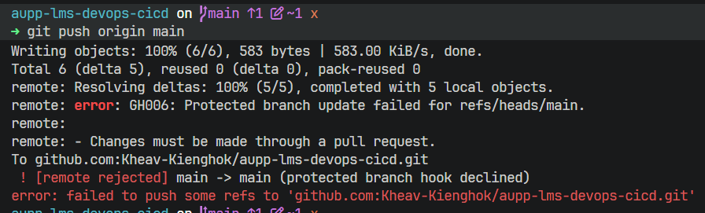

The main branch is protected. Developers cannot push directly; all changes must go through Pull Requests (PRs).

---

**2. Developer A pushes code (creates a PR)**  
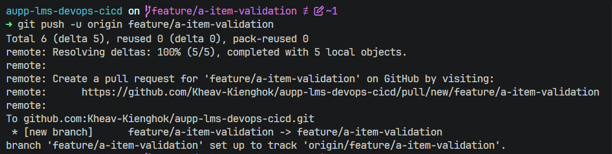

Developer A creates a PR to propose changes. The PR is now awaiting review and approval.

---

**3. PR requires approval**  


At least one approval is required before merging.

---

**4. Developer B creates another PR (same code conflict)**  


Developer B modifies the same lines, causing a conflict.

---

**5. Merge conflict occurs**  


GitHub detects a conflict between both PRs.

---

**6. Resolve conflict manually**  
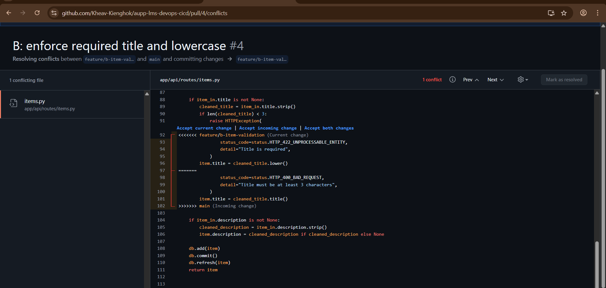

Developers merge changes manually.

---

**7. Update PR after resolving**  
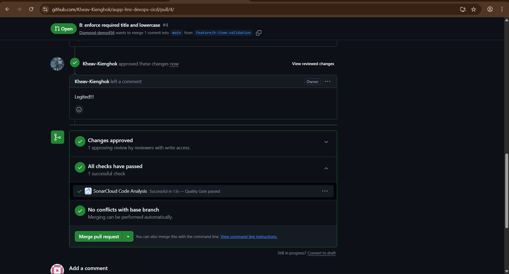

After resolving the conflict, the Pull Request is updated and ready for review again if needed.

---

**8. Merge to main branch**  
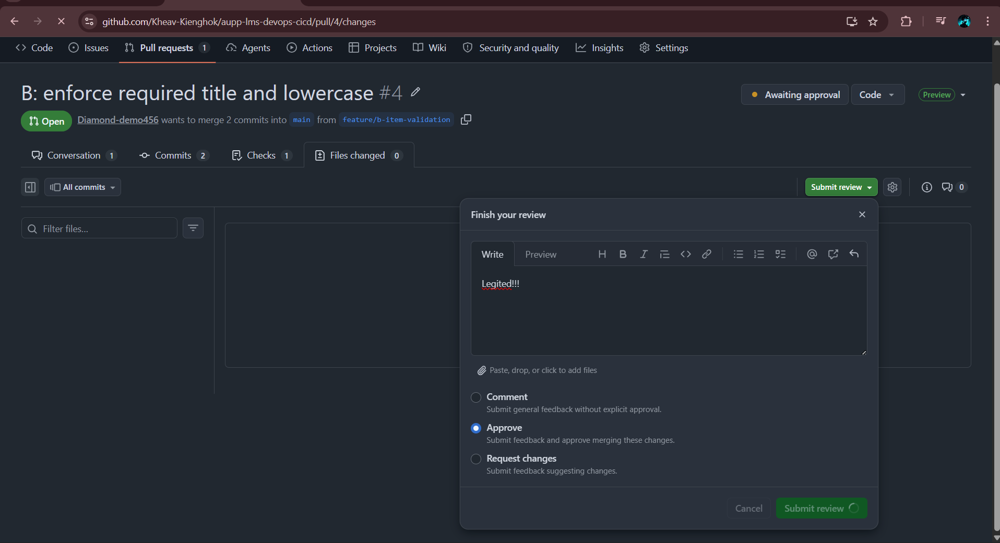  
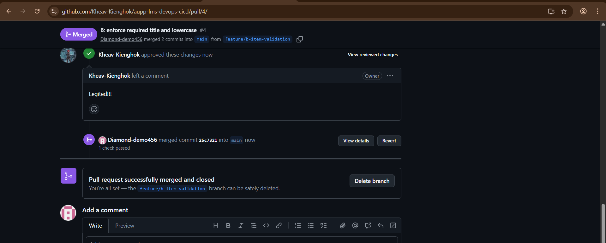

Once approved and conflict-free, the PR is merged.

---

## 2. Continuous Integration (CI)

### CI Workflow

**1. Code push triggers pipeline**  
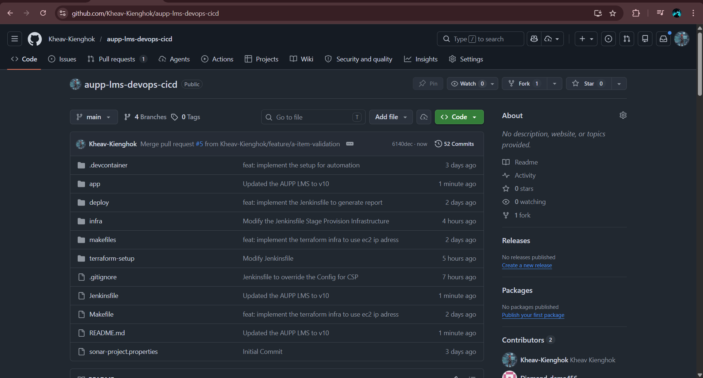

Jenkins pipeline is triggered via webhook.

---

**2. Jenkins pipeline starts**  
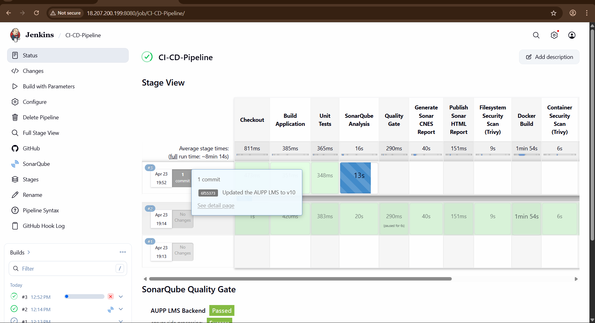

Executes stages defined in the Jenkinsfile.

---

### Jenkinsfile

```groovy
pipeline {
    agent any

    triggers {
        githubPush()
    }

    options {
        timestamps()
        disableConcurrentBuilds()
        skipDefaultCheckout(true)
    }

    /* ---------------------------
     * PARAMETERS (Optional override)
     * --------------------------- */
    parameters {
        string(
            name: 'SONAR_HOST_URL_OVERRIDE',
            defaultValue: 'http://3.208.3.185:9000',
            description: 'Optional SonarQube URL (only for report, leave empty to use Jenkins config)'
        )
    }

    environment {
        /* ---------------------------
         * SOURCE
         * --------------------------- */
        GIT_REPO_URL = 'https://github.com/Kheav-Kienghok/aupp-lms-devops-cicd.git'
        GIT_BRANCH   = 'main'

        /* ---------------------------
         * SONAR
         * --------------------------- */
        SONAR_SCANNER_HOME = tool 'Sonar-Scan'
        SONAR_SERVER = 'sonar-scanner'
        SONAR_PROJECT_KEY = 'aupp-lms-backend'

        /* ---------------------------
         * DOCKER
         * --------------------------- */
        IMAGE_NAME = 'kienghok/aupp-lms'
        IMAGE_TAG  = "v${BUILD_NUMBER}"

        /* ---------------------------
         * AWS
         * --------------------------- */
        AWS_CREDENTIALS = 'aws-credentials'
        AWS_DEFAULT_REGION = 'us-east-1'
    }

    stages {

        /* ---------------------------
         * 1. CHECKOUT
         * --------------------------- */
        stage('Checkout') {
            steps {
                git branch: "${GIT_BRANCH}", url: "${GIT_REPO_URL}"
            }
        }

        /* ---------------------------
         * 2. BUILD
         * --------------------------- */
        stage('Build Application') {
            steps {
                sh 'echo "Build step placeholder"'
            }
        }

        /* ---------------------------
         * 3. TEST
         * --------------------------- */
        stage('Unit Tests') {
            steps {
                sh 'echo "Run tests here"'
            }
        }

        /* ---------------------------
         * 4. SONAR ANALYSIS
         * --------------------------- */
        stage('SonarQube Analysis') {
            steps {
                withSonarQubeEnv("${SONAR_SERVER}") {
                    sh """
                        ${SONAR_SCANNER_HOME}/bin/sonar-scanner
                    """
                }
            }
        }

        /* ---------------------------
         * 5. QUALITY GATE
         * --------------------------- */
        stage('Quality Gate') {
            steps {
                timeout(time: 10, unit: 'MINUTES') {
                    waitForQualityGate abortPipeline: true
                }
            }
        }

        /* ---------------------------
         * 6. CNES REPORT GENERATION
         * --------------------------- */
        stage('Generate Sonar CNES Report') {
            steps {
                withSonarQubeEnv('sonar-scanner') {
                    script {
                        def sonarUrl = params.SONAR_HOST_URL_OVERRIDE?.trim()
                        if (!sonarUrl) {
                            sonarUrl = env.SONAR_HOST_URL
                        }

                        sh """
                            set -e

                            mkdir -p reports/sonar

                            command -v redcoffee >/dev/null 2>&1 || { echo "redcoffee is not installed on this Jenkins node"; exit 1; }

                            redcoffee generatepdf \
                                --host=${sonarUrl} \
                                --project=${SONAR_PROJECT_KEY} \
                                --path=./ \
                                --token=$SONAR_AUTH_TOKEN

                            ls -lah

                            docker run --rm \
                                -v "\$WORKSPACE":/pdf \
                                -w /pdf \
                                sergiomtzlosa/pdf2htmlex \
                                pdf2htmlEX ./generated-sonarqube-report.pdf ./reports/sonar/generated-sonarqube-report.html
                        """
                    }
                }
            }
        }

        /* ---------------------------
         * 7. PUBLISH HTML REPORT
         * --------------------------- */
        stage('Publish Sonar HTML Report') {
            steps {
                publishHTML([
                    reportDir: 'reports/sonar',
                    reportFiles: 'generated-sonarqube-report.html',
                    reportName: 'Sonar PDF Report (HTML)',
                    keepAll: true,
                    alwaysLinkToLastBuild: true,
                    allowMissing: false
                ])
            }
        }

        /* ---------------------------
         * 8. SECURITY SCAN
         * --------------------------- */
        stage('Filesystem Security Scan (Trivy)') {
            steps {
                sh """
                    trivy fs \
                        --severity HIGH,CRITICAL \
                        --exit-code 1 \
                        --no-progress ./app
                """
            }
        }

        /* ---------------------------
         * 9. DOCKER BUILD
         * --------------------------- */
        stage('Docker Build') {
            steps {
                script {
                    env.IMAGE_FULL = "${IMAGE_NAME}:${IMAGE_TAG}"
                    docker.build(env.IMAGE_FULL, "-f app/Dockerfile ./app")
                }
            }
        }

        /* ---------------------------
         * 10. CONTAINER SCAN
         * --------------------------- */
        stage('Container Security Scan (Trivy)') {
            steps {
                sh """
                    trivy image \
                        --severity HIGH,CRITICAL \
                        --ignore-unfixed \
                        --exit-code 1 \
                        --no-progress ${IMAGE_FULL}
                """
            }
        }

        /* ---------------------------
         * 11. PUSH IMAGE
         * --------------------------- */
        stage('Push Docker Image') {
            steps {
                withCredentials([usernamePassword(
                    credentialsId: 'dockerhub-creds',
                    usernameVariable: 'DOCKER_USER',
                    passwordVariable: 'DOCKER_PASS'
                )]) {
                    sh '''
                        echo "$DOCKER_PASS" | docker login -u "$DOCKER_USER" --password-stdin

                        docker push $IMAGE_FULL

                        docker tag $IMAGE_FULL $IMAGE_NAME:latest
                        docker push $IMAGE_NAME:latest

                        docker logout
                    '''
                }
            }
        }

        /* ---------------------------
         * 12. INFRASTRUCTURE
         * --------------------------- */
        stage('Provision Infrastructure') {
            steps {
                withCredentials([
                    [$class: 'AmazonWebServicesCredentialsBinding', credentialsId: "${AWS_CREDENTIALS}"],
                    sshUserPrivateKey(
                        credentialsId: 'ec2-pem-content',
                        keyFileVariable: 'SSH_KEY_FILE',
                        usernameVariable: 'SSH_USER'
                    )
                ]) {
                    dir('infra/terraform') {
                        sh '''
                            set -e
                            chmod 400 "$SSH_KEY_FILE"

                            terraform init
                            terraform apply -auto-approve \
                                -var="ssh_private_key_path=$SSH_KEY_FILE" \
                                -var="ssh_user=$SSH_USER"
                        '''

                        script {
                            env.EC2_HOST = sh(
                                script: "terraform output -raw ec2_public_ip",
                                returnStdout: true
                            ).trim()

                            env.ANSIBLE_INVENTORY = 'infra/ansible/inventory.ini'
                        }
                    }
                }
            }
        }

        /* ---------------------------
         * 13. Deploy to EC2 with Ansible
         * --------------------------- */
        stage('Deploy to EC2') {
            steps {
                withCredentials([sshUserPrivateKey(
                    credentialsId: 'ec2-pem-content',
                    keyFileVariable: 'SSH_KEY_FILE',
                    usernameVariable: 'SSH_USER'
                )]) {
                    sh """
                        set -e
                        chmod 400 "\$SSH_KEY_FILE"

                        ANSIBLE_HOST_KEY_CHECKING=False ansible-playbook \\
                            --private-key "\$SSH_KEY_FILE" \\
                            -u "\$SSH_USER" \\
                            -i infra/ansible/inventory.ini \\
                            infra/ansible/playbooks/deploy.yml \\
                            --extra-vars "image_repo=${IMAGE_NAME} image_tag=${IMAGE_TAG} image_full=${IMAGE_FULL}"
                    """
                }
            }
        }

        /* ---------------------------
         * 14. SMOKE TEST
         * --------------------------- */
        stage('Smoke Test') {
            steps {
                sh '''
                    set -e
                    for i in $(seq 1 12); do
                    if curl -f http://${EC2_HOST}:8000; then
                        exit 0
                    fi
                    echo "Retry $i/12..."
                    sleep 10
                    done
                    exit 1
                '''
            }
        }
    }

    /* ---------------------------
     * POST ACTIONS
     * --------------------------- */
    post {
        success {
            echo "✅ Pipeline SUCCESS — build ${BUILD_NUMBER}"
        }

        failure {
            echo "❌ Pipeline FAILED — check logs"
        }
    }
}
```

This Jenkinsfile defines the full CI/CD pipeline, including checkout, build, testing, code analysis, security scanning, Docker image creation, infrastructure provisioning, deployment, and smoke testing.

---

**3. SonarQube scan**  
SonarQube properties file:

```bash
sonar.projectKey=aupp-lms-backend
sonar.projectName=AUPP LMS Backend
sonar.projectVersion=1.0
sonar.sources=app
sonar.sourceEncoding=UTF-8

# Example for Python
sonar.python.version=3.12

# Optional exclusions
sonar.exclusions=**/__pycache__/**,**/tests/**
```

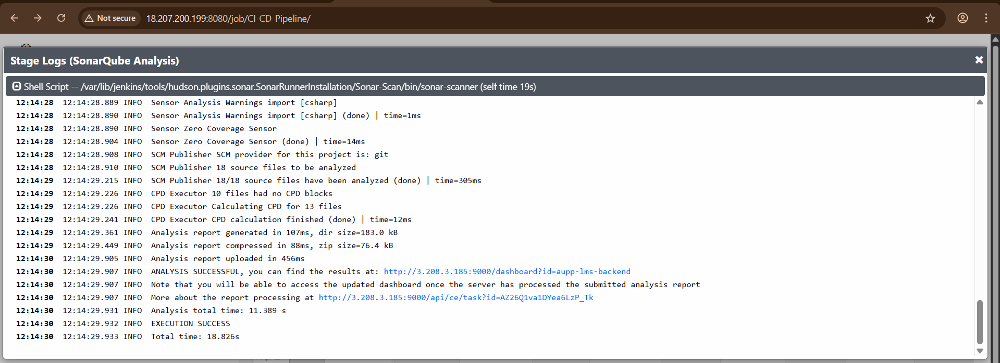  
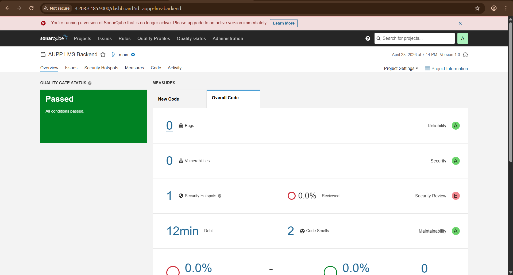  
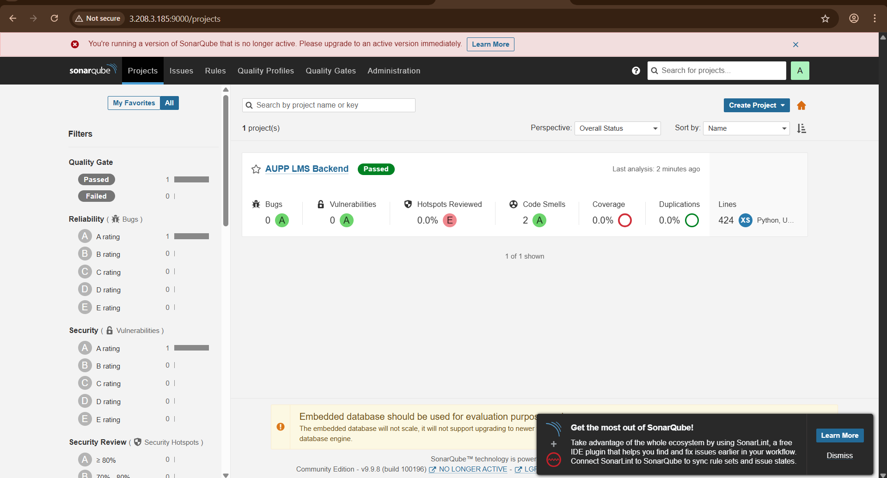  
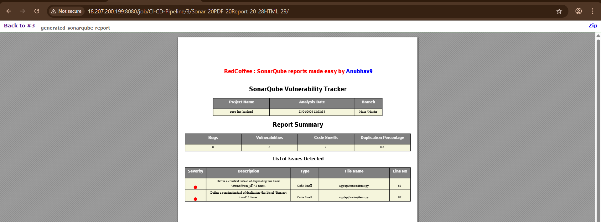

Performs code quality analysis.

---

**4. Quality Gate enforcement**  
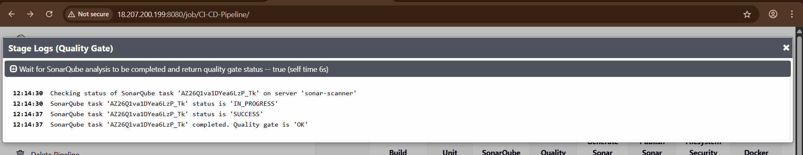

The pipeline proceeds only if the quality gate passes.

---

**5. Trivy security scan**  
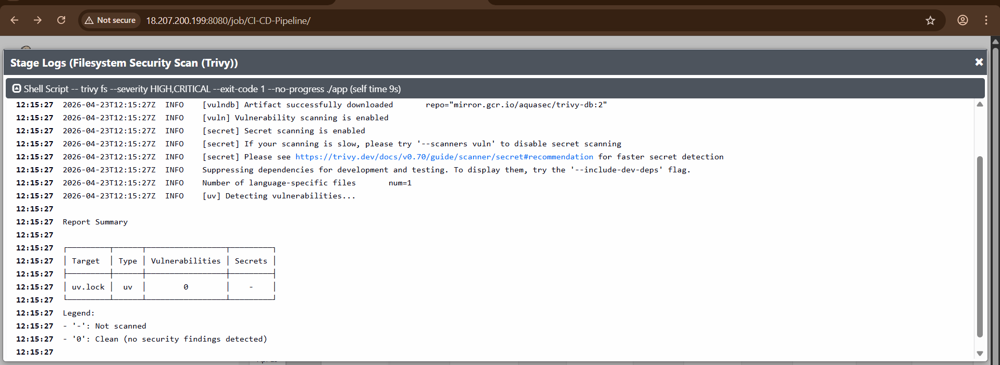  
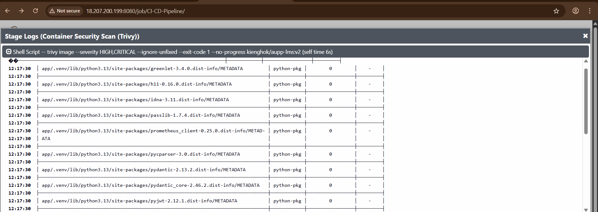  


Trivy scans both the filesystem and Docker image for security vulnerabilities.

---

**6. Docker image build**  


The Docker image is built after successful scans.

---

### Jenkins Credentials Plugin

**7. Secure credentials management**  
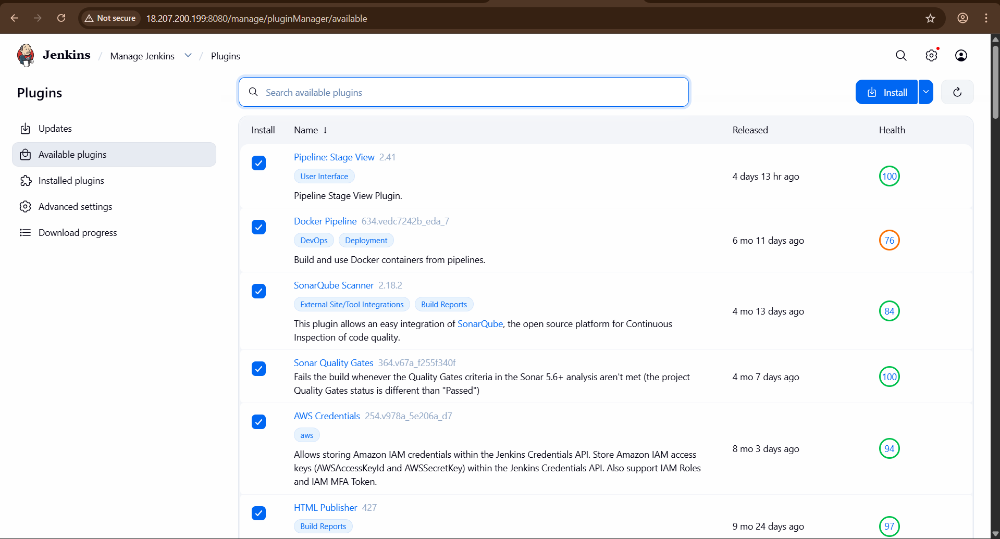  
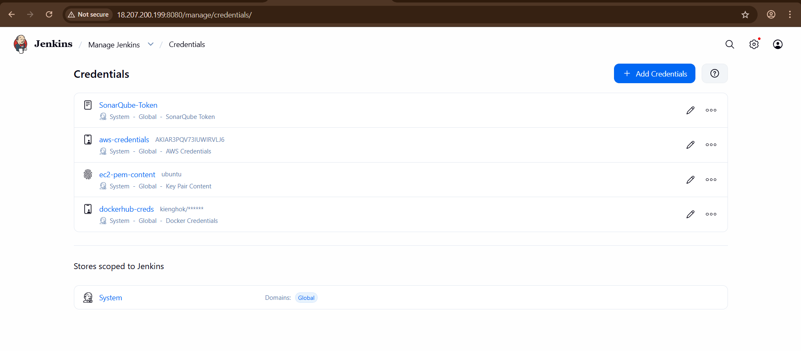

Jenkins securely stores credentials such as Docker Hub credentials, AWS credentials, and SSH private keys.

---

**8. Publish HTML reports**  


HTML reports are published using Jenkins plugins for better visibility and reporting.

---

## 3. Infrastructure as Code (Terraform)

### Overview

Infrastructure is defined using Terraform (`.tf` files), with Ansible used for provisioning and configuration.

### Infra Folder Structure

- `ansible/playbooks/deploy.yml`
- `ansible/playbooks/server.yml`
- `terraform/main.tf`
- `terraform/outputs.tf`
- `terraform/variables.tf`
- `terraform/modules/compute/*`
- `terraform/templates/inventory.ini.tftpl`

---

### Ansible Playbooks

#### deploy.yml

```yaml
- name: Deploy application using Docker Compose V2
  hosts: servers
  become: true
  gather_facts: false

  vars:
    deploy_dir: /home/ubuntu/deploy

  tasks:
    - name: Ensure deployment directory exists
      ansible.builtin.file:
        path: "{{ deploy_dir }}"
        state: directory
        owner: ubuntu
        group: ubuntu
        mode: "0755"

    - name: Copy deploy folder to target host
      ansible.builtin.copy:
        src: "{{ playbook_dir }}/../../../deploy/"
        dest: "{{ deploy_dir }}/"
        owner: ubuntu
        group: ubuntu
        mode: preserve

    - name: Pull Docker image (specific tag)
      ansible.builtin.command: "docker pull {{ image_full }}"
      changed_when: true

    - name: Tag image as latest
      ansible.builtin.command: "docker tag {{ image_full }} {{ image_repo }}:latest"
      changed_when: true

    - name: Restart services using Docker Compose V2
      community.docker.docker_compose_v2:
        project_src: "{{ deploy_dir }}"
        state: present
        recreate: always
        remove_orphans: true

    - name: Show running containers
      ansible.builtin.command: docker ps
      changed_when: false
```

---

#### server.yml

```yaml
- name: Configure server with Docker and Docker Compose
  hosts: servers
  become: true
  gather_facts: true

  pre_tasks:
    - name: Wait for cloud-init
      ansible.builtin.shell: |
        if command -v cloud-init >/dev/null 2>&1; then
          cloud-init status --wait
        fi
      changed_when: false

    - name: Update packages (Debian)
      ansible.builtin.apt:
        update_cache: true
        upgrade: dist
      when: ansible_facts.os_family == "Debian"

    - name: Update packages (RedHat)
      ansible.builtin.dnf:
        name: "*"
        state: latest
        update_only: true
      when: ansible_facts.os_family == "RedHat"

  tasks:
    - name: Install curl
      ansible.builtin.package:
        name: curl
        state: present

    - name: Install Docker
      ansible.builtin.shell: |
        curl -fsSL https://get.docker.com | sh
      args:
        creates: /usr/bin/docker

    - name: Start Docker
      ansible.builtin.service:
        name: docker
        state: started
        enabled: true

    - name: Install Docker Compose plugin
      ansible.builtin.package:
        name: docker-compose-plugin
        state: present
      ignore_errors: true
```

---

### Terraform Core Files

#### main.tf

```hcl
terraform {
  required_version = ">= 1.5.0"

  required_providers {
    aws = {
      source  = "hashicorp/aws"
      version = "~> 6.0"
    }
    local = {
      source  = "hashicorp/local"
      version = "~> 2.5"
    }
    null = {
      source  = "hashicorp/null"
      version = "~> 3.2"
    }
  }
}

provider "aws" {
  region = var.aws_region
}

data "aws_key_pair" "existing" {
  key_name = var.key_name
}

module "compute" {
  source = "./modules/compute"

  name_prefix   = var.name_prefix
  ami_id        = var.ami_id
  instance_type = var.instance_type
  key_name      = var.key_name
  my_ip_cidr    = var.my_ip_cidr
}

resource "local_file" "ansible_inventory" {
  count = var.provision_with_ansible ? 1 : 0

  content = templatefile("${path.module}/templates/inventory.ini.tftpl", {
    host     = module.compute.ec2_public_ip
    ssh_user = var.ssh_user
  })

  filename = "${path.module}/../ansible/inventory.ini"
}

resource "null_resource" "wait_for_cloud_init" {
  count = var.provision_with_ansible ? 1 : 0

  triggers = {
    instance_id = module.compute.instance_id
  }

  connection {
    type        = "ssh"
    host        = module.compute.ec2_public_ip
    user        = var.ssh_user
    private_key = file(var.ssh_private_key_path)
    timeout     = "5m"
  }

  provisioner "remote-exec" {
    inline = [
      "cloud-init status --wait || true"
    ]
  }
}

resource "null_resource" "ansible_provision" {
  count = var.provision_with_ansible ? 1 : 0

  depends_on = [
    local_file.ansible_inventory[0],
    null_resource.wait_for_cloud_init[0]
  ]

  triggers = {
    instance_id = module.compute.instance_id
  }

  provisioner "local-exec" {
    command = "ANSIBLE_HOST_KEY_CHECKING=False ansible-playbook --private-key ${abspath(var.ssh_private_key_path)} -i ${local_file.ansible_inventory[0].filename} ${abspath(\"${path.module}/../ansible/playbooks/server.yml\")}"
  }
}
```

---

#### outputs.tf

```hcl
output "ec2_public_ip" {
  value = module.compute.ec2_public_ip
}

output "ansible_inventory_path" {
  value = var.provision_with_ansible ? local_file.ansible_inventory[0].filename : null
}
```

---

#### variables.tf

```hcl
variable "aws_region" {
  description = "AWS region for infrastructure deployment"
  type        = string
  default     = "us-east-1"
}

variable "name_prefix" {
  description = "Prefix used for naming AWS resources"
  type        = string
  default     = "aupp-lms"
}

variable "instance_type" {
  description = "EC2 instance size"
  type        = string
  default     = "t2.micro"
}

variable "ami_id" {
  description = "Amazon Linux or Ubuntu AMI ID"
  type        = string
  default     = "ami-009d9173b44d0482b"
}

variable "key_name" {
  description = "Existing AWS key pair"
  type        = string
  default     = "devop-final-key"
}

variable "my_ip_cidr" {
  description = "Your public IP in CIDR format"
  type        = string
  default     = "0.0.0.0/0"
}

variable "ssh_private_key_path" {
  description = "Path to SSH private key"
  type        = string
  default     = "../keys/devop-final-key.pem"
}

variable "ssh_user" {
  description = "SSH user for EC2"
  type        = string
  default     = "ubuntu"
}

variable "provision_with_ansible" {
  description = "Run Ansible provisioning"
  type        = bool
  default     = true
}
```

---

### Terraform Module: Compute

#### modules/compute/main.tf

```hcl
resource "aws_security_group" "this" {
  name        = "${var.name_prefix}-sg"
  description = "Allow SSH, app, Prometheus, and Grafana"

  ingress {
    description = "SSH"
    from_port   = 22
    to_port     = 22
    protocol    = "tcp"
    cidr_blocks = [var.my_ip_cidr]
  }

  ingress {
    description = "Application"
    from_port   = 8000
    to_port     = 8000
    protocol    = "tcp"
    cidr_blocks = ["0.0.0.0/0"]
  }

  ingress {
    description = "Prometheus"
    from_port   = 9090
    to_port     = 9090
    protocol    = "tcp"
    cidr_blocks = [var.my_ip_cidr]
  }

  ingress {
    description = "Grafana"
    from_port   = 3000
    to_port     = 3000
    protocol    = "tcp"
    cidr_blocks = [var.my_ip_cidr]
  }

  egress {
    from_port   = 0
    to_port     = 0
    protocol    = "-1"
    cidr_blocks = ["0.0.0.0/0"]
  }
}

resource "aws_instance" "this" {
  ami                    = var.ami_id
  instance_type          = var.instance_type
  key_name               = var.key_name
  vpc_security_group_ids = [aws_security_group.this.id]
  associate_public_ip_address = true

  tags = {
    Name = "${var.name_prefix}-ec2"
  }
}
```

---

### Inventory Template

```ini
[servers]
app ansible_host=${host} ansible_user=${ssh_user} ansible_ssh_common_args='-o StrictHostKeyChecking=no'
```

---

### Provisioning Result

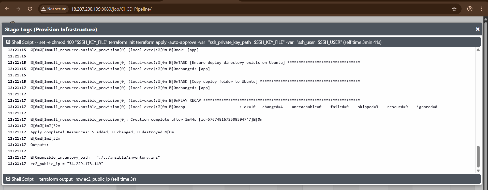

Terraform provisions the infrastructure, and Ansible configures the server environment automatically.

---

## 4. Continuous Deployment (CD)

### Deployment Workflow

**1. CI success triggers deployment**  
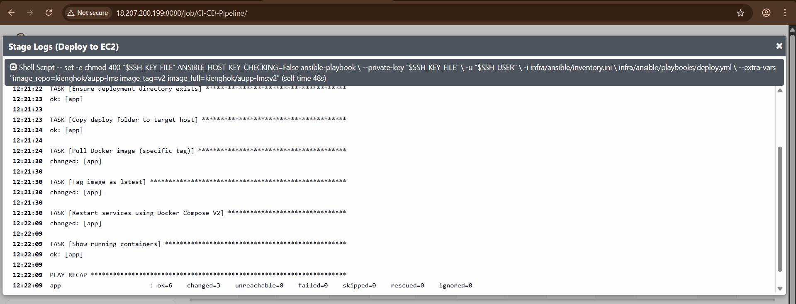

Successful CI stages automatically continue into deployment.

---

**2. Health check using curl**  
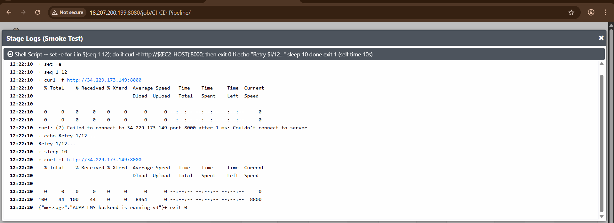

After deployment, the application is verified using a curl-based smoke test.

---

## 5. Monitoring & Observability

### Prometheus & Grafana

**1. Prometheus collects metrics**

```bash
global:
  scrape_interval: 15s

scrape_configs:

  - job_name: "aupp-lms-app"
    metrics_path: /metrics
    static_configs:
      - targets: ["app:8000"]

  - job_name: "prometheus"
    static_configs:
      - targets: ["prometheus:9090"]
```

Prometheus collects and stores metrics from the LMS application and from Prometheus itself.

---

**2. Grafana visualizes dashboards**  
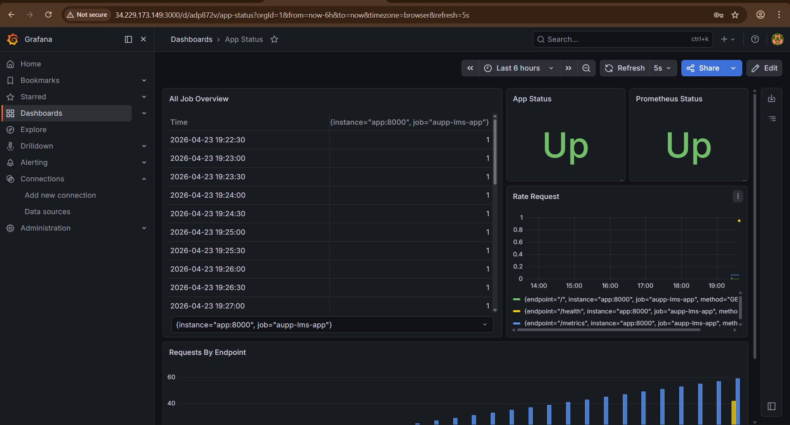

Grafana provides dashboard-based visualization for monitoring system and application performance.

---

**3. AWS EC2 verification**  
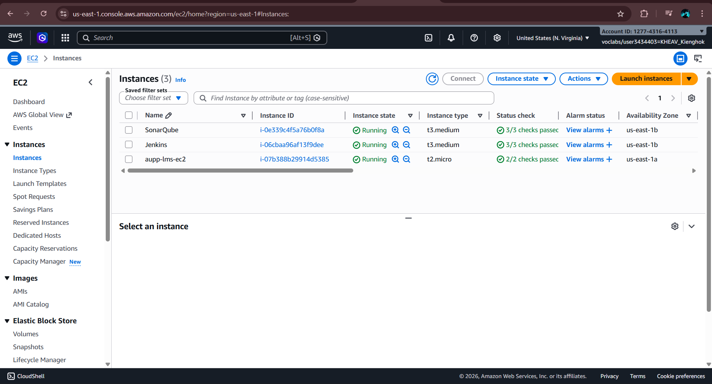

The AWS EC2 console confirms that the provisioned infrastructure is running successfully.

---

## Objectives

- Apply GitHub workflow (PR, review, conflict resolution)
- Automate CI pipeline using Jenkins
- Enforce code quality with SonarQube
- Perform security scans with Trivy
- Build Docker images
- Provision AWS EC2 using Terraform
- Deploy application automatically
- Access application from browser
- Monitor system using Prometheus & Grafana

---

## CI/CD Workflow Architecture

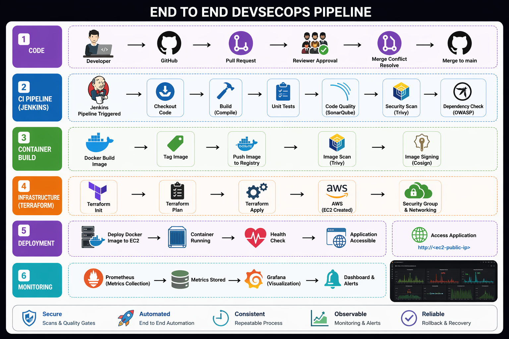

This diagram shows the complete DevOps workflow from development, integration, security validation, deployment, and monitoring.

---

## Pipeline Success & UI

**1. Jenkins pipeline dashboard**  
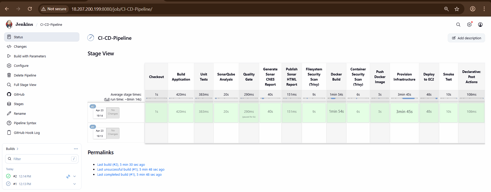  
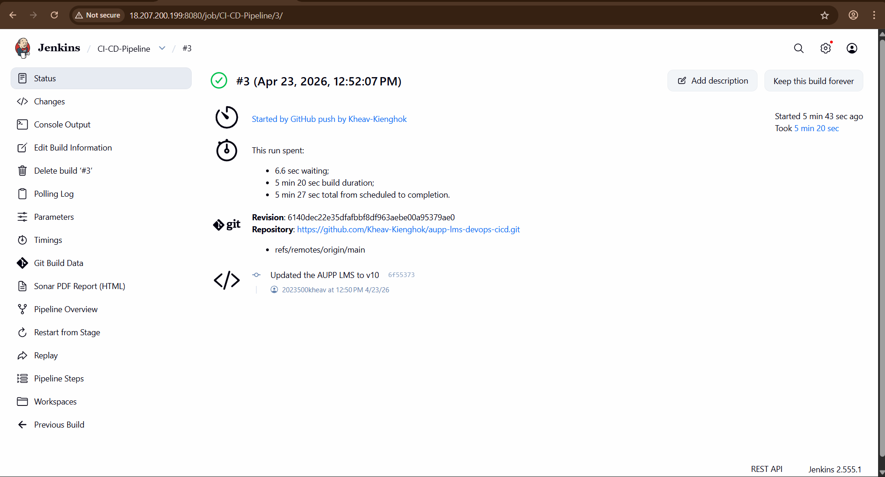

These screenshots show the Jenkins pipeline stages completing successfully.

---

**2. Application accessible**  
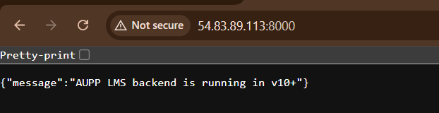

This confirms that the application is successfully deployed and accessible through the browser.

---

## Tools & Technologies Used

| Category               | Tool       |
|------------------------|------------|
| Source Control         | GitHub     |
| CI/CD Pipeline         | Jenkins    |
| Code Quality           | SonarQube  |
| Security Scan          | Trivy      |
| Containerization       | Docker     |
| Infrastructure as Code | Terraform  |
| Cloud Provider         | AWS EC2    |
| Monitoring             | Prometheus |
| Visualization          | Grafana    |

---

**End of Document**